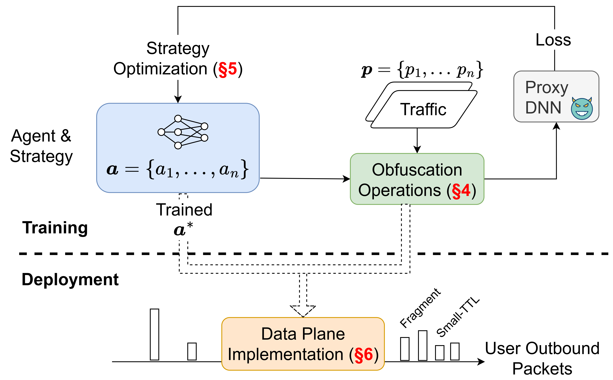

**Securitas: Defending against Traffic Analysis Attacks with Flexible In-Network Obfuscation NSDI‘26**

Welcome to Securitas! Securitas protects encrypted traffic from traffic-analysis side channels through
learning-guided packet fragmentation and fake-packet insertion. This release
focuses on the Web/WF artifact path: DF attack-model training, Securitas policy
training, generated P4 rule entries, and a Tofino-style P4 test program.


## Code Architecture

```text
-- web_attack_models
    -- prepare_cw100_df.py        preprocess CW100 Web/WF traces
    -- train_df.py                train the DF proxy attack model
    -- model.py                   DF model definition
    -- data/                      processed attack-model data workspace

-- web_securitas_training
    -- train_securitas.py         train the Securitas obfuscation policy
    -- generate_p4.py             export learned policy to P4 table entries
    -- BSCAttack_agents.py        policy-gradient training agent
    -- model.py                   models and feature utilities
    -- utils.py                   evaluation helpers
    -- data/                      processed Securitas training data workspace
    -- DF_800_split_88_0.7_0.6/   default trained policy output
    -- patch_p4_code/             generated P4 rule files

-- p4_test
    -- Sec.p4                     main P4 data-plane program
    -- WF_800.p4                  generated table entries included by Sec.p4
    -- Sec_ports.json             port configuration
    -- controller_session_id_conf.py
                                  mirror-session and register setup
    -- sendpkt_testlogic.py       simple Scapy packet test script
```


## Environment

```bash
conda env create -f environment.yml
conda activate securitas
```

## Run Web/WF Data Processing

The Web/WF experiments use the CW100 dataset from Rimmer et al. The dataset can
be found at:

https://distrinet.cs.kuleuven.be/software/tor-wf-dl/.

Put the raw CW100 files under `web_attack_models/data/`:

```text
web_attack_models/data/tor_100w_2500tr.npz
web_attack_models/data/tor_run_v1_001/
```

Generate the processed DF data:

```bash
cd web_attack_models
python prepare_cw100_df.py
cd ..
```

Copy the processed data into the Securitas training workspace:

```bash
cp web_attack_models/data/data_2000.pkl web_securitas_training/data/data_2000.pkl
cp web_attack_models/data/label_2000.pkl web_securitas_training/data/label_2000.pkl
```

Expected processed files:

```text
web_attack_models/data/data_2000.pkl
web_attack_models/data/label_2000.pkl
web_securitas_training/data/data_2000.pkl
web_securitas_training/data/label_2000.pkl
```

## Run DF Attack-Model Training

```bash
cd web_attack_models
python train_df.py
cd ..
```

Output:

```text
web_attack_models/model_DF.pth
```

Copy the checkpoint used by Securitas training:

```bash
cp web_attack_models/model_DF.pth web_securitas_training/model_DF.pth
```

## Run Securitas Training

Train the default Web/WF policy:

```bash
cd web_securitas_training
python train_securitas.py \
  --model-name DF \
  --patch-length 800 \
  --split-ratio 0.7 \
  --loss-weights 0.6,0.2,0.2
cd ..
```

Outputs:

```text
web_securitas_training/DF_800_split_88_0.7_0.6/best_mind.pth
web_securitas_training/DF_800_split_88_0.7_0.6/results.txt
```

The default Web/WF policy is:

```text
DF_800_split_88_0.7_0.6
```

It corresponds to patch length `800`, split ratio `0.7`, maximum mirrored
payload length `88`, and loss weights `0.6,0.2,0.2`.

## Generate P4 Rules

Export the learned policy to P4 table entries:

```bash
cd web_securitas_training
python generate_p4.py \
  --patch-length 800 \
  --policy-dir ./DF_800_split_88_0.7_0.6 \
  --max-patch-num 8
cd ..
```

Output:

```text
web_securitas_training/patch_p4_code/WF_800.p4
```

Copy the generated rule file next to the test P4 program:

```bash
cp web_securitas_training/patch_p4_code/WF_800.p4 p4_test/WF_800.p4
```

`p4_test/Sec.p4` includes this file inside the `assign_patch_info` table. The
included file provides the table's `const entries` block, mapping
`(patch_idx, pkt_cnt)` to either `ac_should_TTL(mir_len)` or
`ac_should_fragment(mir_len)`. Packets not listed in that generated table use
the table's `default_action = ac_jump_deparser()`.

## Run P4 Program

Compile `Sec.p4` on a Barefoot/Intel Tofino SDE setup. Keep `WF_800.p4` in the
same directory as `Sec.p4` so the preprocessor can resolve the relative include.
The example below stages the P4 files under the SDE build directory and then
uses a relative `P4_PATH`.

```bash
mkdir -p $SDE/pkgsrc/p4-build/securitas_p4
cp p4_test/Sec.p4 p4_test/WF_800.p4 p4_test/Sec_ports.json \
  p4_test/controller_session_id_conf.py p4_test/sendpkt_testlogic.py \
  $SDE/pkgsrc/p4-build/securitas_p4/
cd $SDE/pkgsrc/p4-build
./configure \
  --prefix=$SDE_INSTALL \
  --with-tofino \
  --with-bf-runtime \
  P4_NAME=Sec \
  P4_PATH=securitas_p4/Sec.p4 \
  P4_VERSION=p4-16 \
  P4C=p4c \
  --enable-thrift
make
make install
```

Run the compiled P4 program:

```bash
cd $SDE
./run_switchd.sh -p Sec
```

Configure mirror sessions and clear the packet-count register in the BFRT
Python environment:

```bash
cd $SDE
bfshell -b pkgsrc/p4-build/securitas_p4/controller_session_id_conf.py
```

Send simple test packets from the host namespace used by the testbed:

```bash
cd $SDE
sudo python3 pkgsrc/p4-build/securitas_p4/sendpkt_testlogic.py
```

## Citation

If you use Securitas in your research, please cite the NSDI '26 paper:

```bibtex
@inproceedings{xie2026defending,
  title={Defending against Traffic Analysis Attacks with Flexible In-Network Obfuscation},
  author={Xie, Guorui and Li, Qing and Shi, Zhenning and Antichi, Gianni and Zhu, Yijia and Li, Kejun and Weng, Changxing and Miano, Sebastiano and Jiang, Yong and Xu, Mingwei},
  booktitle={23rd USENIX Symposium on Networked Systems Design and Implementation (NSDI 26)},
  pages={2043--2063},
  year={2026}
}
```

## Notes

- The repository uses relative paths for all runnable scripts.
- Generated datasets, checkpoints, and policy outputs are local artifacts.
- This cleaned release contains the Web/WF artifact path and the P4 test
  program. Other implementation targets discussed in the paper are outside this
  release.


<small>*Last update: May 1st, 2026</small>